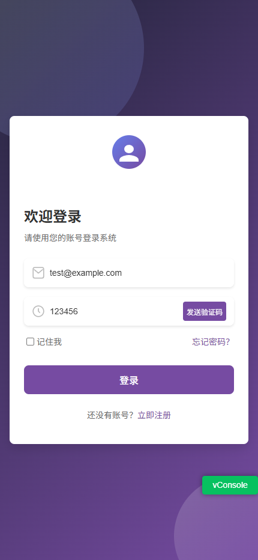
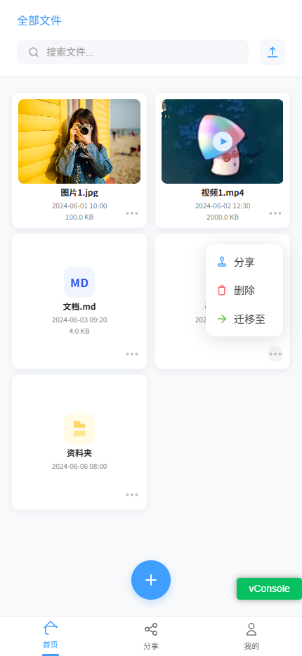

# vite-vue3-app
#### 该项目为练手,有空继续完善功能
#### 介绍
一个vite+vue3的App个人云盘

#### 软件架构
 Vite + Vue3 + Typescript + Eslint9 + Prettier + Husky + Commitlint + Stylelint 

#### 功能特性
1. 文件管理
   - 文件列表展示
   - 文件预览功能
   - 文件上传功能（支持拖拽上传）
   - 文件删除功能

2. 用户系统
   - 用户登录
   - 用户注册
   - 个人信息管理

3. 界面特性
   - 响应式设计
   - 现代化UI界面
   - 友好的用户交互

#### 部分界面展示

##### 登录页面

##### 首页

##### 图片展示

##### 视频展示

#### 安装教程

1.  pnpm install

#### 特技
 vite.config.ts 集成了postcssPxtorem插件，可以自动将px单位转换为rem单位，提高开发效率。

 ##### 注意事项
  修改设计稿大小同时需要在html页面修改相应的根字体大小，默认是375px的设计稿
